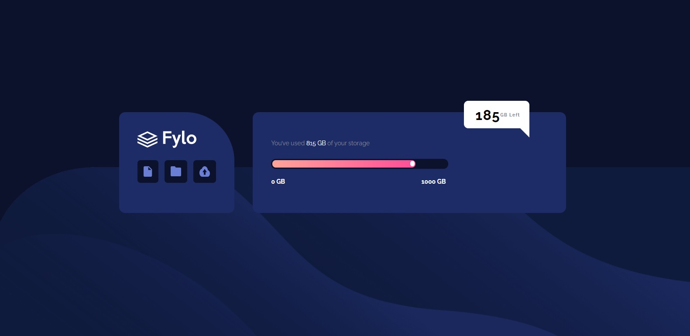
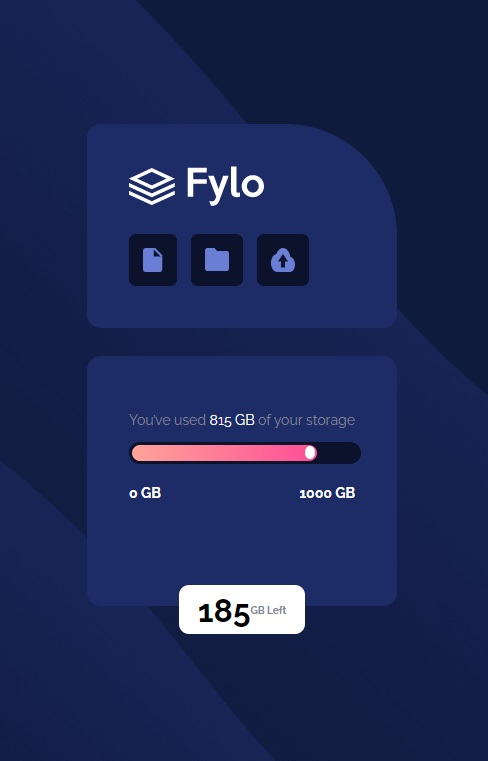

# Frontend Mentor - Fylo data storage component solution

This is a solution to the [Fylo data storage component challenge on Frontend Mentor](https://www.frontendmentor.io/challenges/fylo-data-storage-component-1dZPRbV5n). Frontend Mentor challenges help you improve your coding skills by building realistic projects.

## Table of contents

- [Overview](#overview)
  - [The challenge](#the-challenge)
  - [Screenshot](#screenshot)
- [My process](#my-process)
  - [Built with](#built-with)
  - [What I learned](#what-i-learned)
- [Author](#author)

## Overview

### The challenge

Users should be able to:

- View the optimal layout for the site depending on their device's screen size

### Screenshot




## My process

### Built with

- Semantic HTML5 markup
- CSS custom properties

- CSS Grid
- Mobile-first workflow

### What I learned

Different styles for same elements.

```html
<div class="scale">
  <div class="scale__amount">
    <div class="scale__indicator"></div>
  </div>
</div>
```

```css
.scale {
  width: 100%;
  height: 1.2rem;
  background-color: var(--VeryDarkBlue);
  border-radius: 50px;
  padding: 0.2em;
  margin: 1em 0 0.5em 0;
}

.scale__amount {
  width: 82%;
  height: 100%;
  background-image: linear-gradient(to right, #ffa399, #ff4d97);
  border-radius: 50px;
  padding: 0;
}

.scale__indicator {
  height: 75%;
  width: 10px;
  padding-top: 0px;
  position: relative;
  top: 1.5px;
  right: 2.4px;
  background-color: #fff;
  border-radius: 50%;
  margin-left: auto;
}
```

## Author

- Linkedin - [İsmail Üçel](https://www.linkedin.com/in/ismail-%C3%BC%C3%A7el-a487b618a/)
