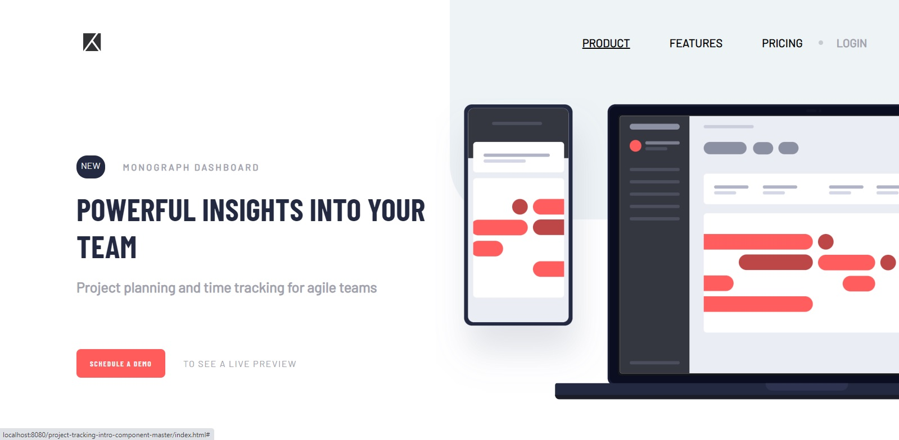
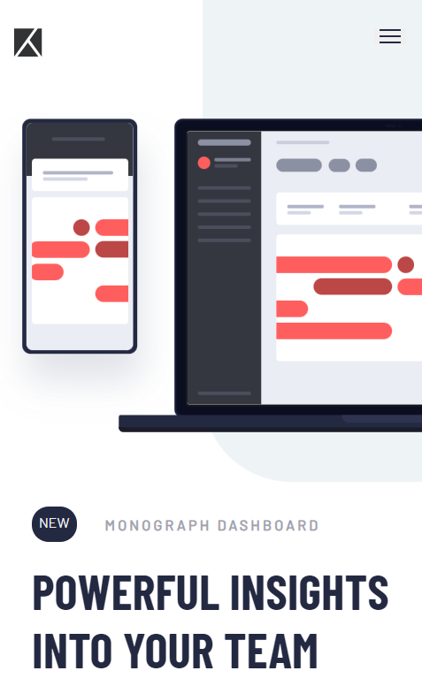
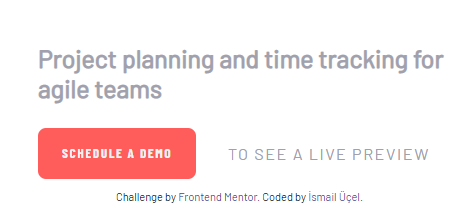
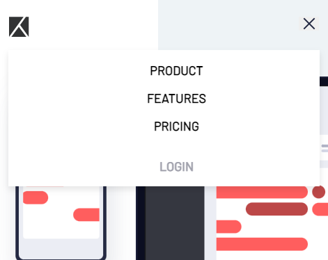

# Frontend Mentor - Project tracking intro component solution

This is a solution to the [Project tracking intro component challenge on Frontend Mentor](https://www.frontendmentor.io/challenges/project-tracking-intro-component-5d289097500fcb331a67d80e). Frontend Mentor challenges help you improve your coding skills by building realistic projects.

## Table of contents

- [Overview](#overview)
  - [The challenge](#the-challenge)
  - [Screenshot](#screenshot)
- [My process](#my-process)
  - [Built with](#built-with)
  - [What I learned](#what-i-learned)
- [Author](#author)
- [Acknowledgments](#acknowledgments)

## Overview

### The challenge

Users should be able to:

- View the optimal layout for the site depending on their device's screen size
- See hover states for all interactive elements on the page
- Create the background shape using code

### Screenshot






## My process

### Built with

- Semantic HTML5 markup
- CSS properties
- Flexbox
- Vanilla JS
- Mobile-first workflow

### What I learned

Hamburger Menu with JS-CSS
Transform Scale

```html
<button href="#" class="hamburger" id="hamburger">
  
  
</button>
```

```css
body::after {
  background-color: var(--LightGrayishBlue);
  border-bottom-left-radius: 100px;
  content: "";
  position: absolute;
  top: 0;
  right: 0;
  height: 70vh;
  width: 50vw;
  z-index: -1;
}

.hamburger {
  display: block;
  border: none;
}
.hamburger:focus {
  outline: none;
}

.icon-hamburger {
  display: block;
}

.icon-close {
  display: none;
}

.show-nav .icon-close {
  display: block;
}

.show-nav .icon-hamburger {
  display: none;
}

.show-nav ul {
  transform: translateX(0);
}

ul {
  background-color: white;
  box-shadow: 0 5px 10px rgba(0, 0, 0, 0.1);
  flex-direction: column;
  position: fixed;
  top: 70px;
  left: 20px;
  width: calc(100% - 40px);
  transform: translateX(120%);
  z-index: 100;
  transition: transform 0.4s ease;
}

ul li.login::before {
  border-radius: 0;
  top: 0;
  right: 5%;
  left: 5%;
  transform: translate(0px, 150px);
  height: 1px;
  width: 90%;
  opacity: 0.5;
  content: "";
  position: absolute;
}

.pics img {
  max-width: 100%;
  transform: scale(1.6) translateX(17%);
}
```

```js
const hamburger = document.getElementById("hamburger");
const { body } = document;

hamburger.addEventListener("click", () => {
  body.classList.toggle("show-nav"); //yoksa show-nav class'ını ekle varsa sil
});
```

## Author

- Linkedin - [İsmail Üçel](https://www.linkedin.com/in/ismail-%C3%BC%C3%A7el-a487b618a/)
