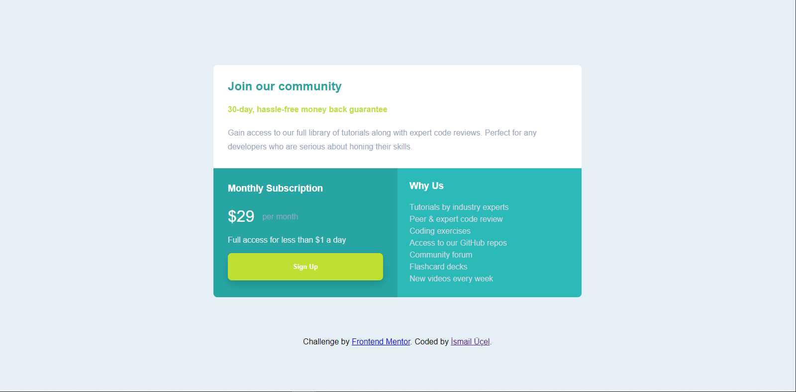

# Frontend Mentor - Single price grid component solution

This is a solution to the [Single price grid component challenge on Frontend Mentor](https://www.frontendmentor.io/challenges/single-price-grid-component-5ce41129d0ff452fec5abbbc). Frontend Mentor challenges help you improve your coding skills by building realistic projects. 

## Table of contents

- [Overview](#overview)
  - [The challenge](#the-challenge)
  - [Screenshot](#screenshot)
- [My process](#my-process)
  - [Built with](#built-with)
  - [What I learned](#what-i-learned)
- [Author](#author)

## Overview

### The challenge

Users should be able to:

- View the optimal layout for the component depending on their device's screen size
- See a hover state on desktop for the Sign Up call-to-action

### Screenshot

*

## My process

### Built with

- Semantic HTML5 markup
- CSS custom properties
- Flexbox
- CSS Grid
- Mobile-first workflow
- [Styled Components](https://makingcss.com/transition) - For transitions

### What I learned

This was the first project that i used css grid architecture. 
This was the first project that i used mobile first design.

To see how you can add code snippets, see below:

    .container{
        display: grid;
        grid-template-columns: 1fr 1fr;
        margin: 5rem;
    }

    .card1{
        grid-column-start: 1 ;
        grid-column-end: -1;
        
    }

    .card2{
        grid-row-start: 2;
        grid-row-end: 4;
        border-radius: 0 0 0 0.5rem;
    }

## Author

- Linkedin - [İsmail Üçel](https://www.linkedin.com/in/ismail-%C3%BC%C3%A7el-a487b618a/)
