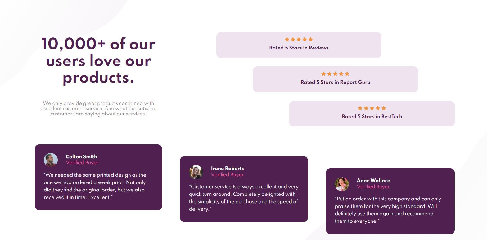

# Frontend Mentor - Social proof section solution

This is a solution to the [Social proof section challenge on Frontend Mentor](https://www.frontendmentor.io/challenges/social-proof-section-6e0qTv_bA). Frontend Mentor challenges help you improve your coding skills by building realistic projects.

## Table of contents

- [Overview](#overview)
  - [The challenge](#the-challenge)
  - [Screenshot](#screenshot)
- [My process](#my-process)
  - [Built with](#built-with)
  - [What I learned](#what-i-learned)
- [Author](#author)

## Overview

### The challenge

Users should be able to:

- View the optimal layout for the section depending on their device's screen size

### Screenshot

## My process

### Built with

- Semantic HTML5 markup
- CSS custom properties
- Flexbox
- CSS Grid
- Mobile-first workflow

### What I learned

CSS Grid

.container {
margin: 6rem;
display: grid;
grid-template-areas:
"header header header header . ratingOne ratingOne ratingOne ratingOne ratingOne . ."
"header header header header . . ratingTwo ratingTwo ratingTwo ratingTwo ratingTwo ."
"littleHeader littleHeader littleHeader littleHeader . . . ratingThree ratingThree ratingThree ratingThree ratingThree"
"card1 card1 card1 card1 . . . . . . . ."
"card1 card1 card1 card1 card2 card2 card2 card2 . . . ."
"card1 card1 card1 card1 card2 card2 card2 card2 card3 card3 card3 card3"
"card1 card1 card1 card1 card2 card2 card2 card2 card3 card3 card3 card3"
"card1 card1 card1 card1 card2 card2 card2 card2 card3 card3 card3 card3"
"card1 card1 card1 card1 card2 card2 card2 card2 card3 card3 card3 card3"
"card1 card1 card1 card1 card2 card2 card2 card2 card3 card3 card3 card3"
". . . . card2 card2 card2 card2 card3 card3 card3 card3"
". . . . . . . .card3 card3 card3 card3";
}

## Author

- Linkedin - [İsmail Üçel](https://www.linkedin.com/in/ismail-%C3%BC%C3%A7el-a487b618a/)
