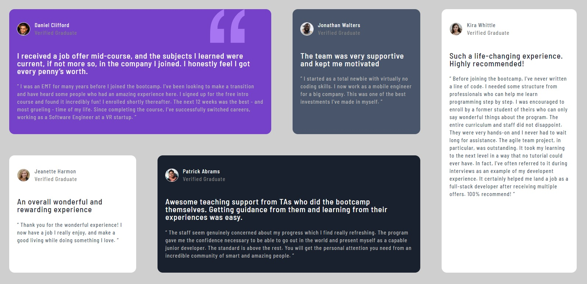
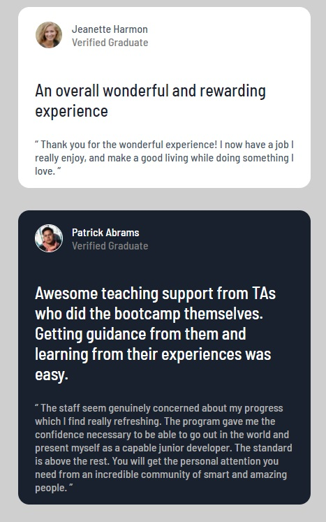

# Frontend Mentor - Testimonials grid section solution

This is a solution to the [Testimonials grid section challenge on Frontend Mentor](https://www.frontendmentor.io/challenges/testimonials-grid-section-Nnw6J7Un7). Frontend Mentor challenges help you improve your coding skills by building realistic projects.

## Table of contents

- [Overview](#overview)
  - [The challenge](#the-challenge)
  - [Screenshot](#screenshot)
- [My process](#my-process)
  - [Built with](#built-with)
  - [What I learned](#what-i-learned)
- [Author](#author)

## Overview

### The challenge

Users should be able to:

- View the optimal layout for the site depending on their device's screen size

### Screenshot

## My process

### Built with

- Semantic HTML5 markup
- CSS custom properties
- Flexbox
- CSS Grid
- Mobile-first workflow

### What I learned

Got better at grid system.

@media screen and (min-width: 792px) {
.container {
display: grid;
grid-template-areas:
"daniel daniel daniel jonathan kira"
"jeanette patrick patrick patrick kira";
}

.daniel {
grid-area: daniel;
line-height: 1.5rem;
letter-spacing: 0.07rem;
}
.jonathan {
grid-area: jonathan;
line-height: 1.5rem;
letter-spacing: 0.07rem;
}
.kira {
grid-area: kira;
line-height: 1.5rem;
letter-spacing: 0.07rem;
}
.patrick {
grid-area: patrick;
line-height: 1.5rem;
letter-spacing: 0.07rem;
}
.jeanette {
grid-area: jeanette;
line-height: 1.5rem;
letter-spacing: 0.07rem;
}
}

## Author

- Linkedin - [İsmail Üçel](https://www.linkedin.com/in/ismail-%C3%BC%C3%A7el-a487b618a/)
